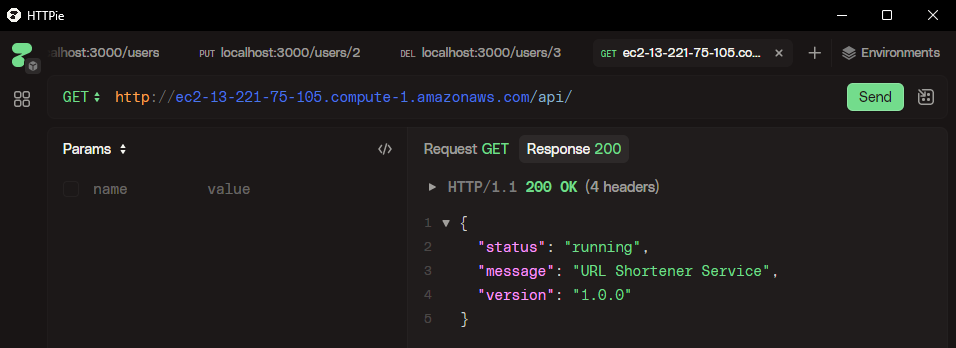
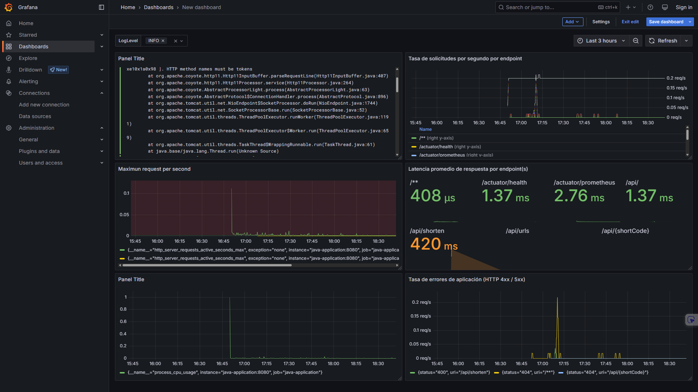

# Bitácora Experimento - Observabilidad y Monitoreo

**Nombre del estudiante:** _____________________________  
---

Cuando acabes no olvides ayudarnos evaluando tu ⭐[experiencia](https://forms.office.com/r/US1LARPmec)⭐

## Tabla de Contenidos
- [Etapa 1: Preparación del Ambiente](#etapa-1-preparación-del-ambiente)
- [Etapa 2: Métricas Iniciales](#etapa-2-métricas-iniciales)
- [Etapa 2.1: Dashboard Base en Grafana](#etapa-21-dashboard-base-en-grafana)
- [Etapa 2.2: Propuesta de Métrica Personalizada](#etapa-22-propuesta-de-métrica-personalizada)
- [Etapa 3: Experimentación y Análisis del Sistema](#etapa-3-experimentación-y-análisis-del-sistema)

---

## Etapa 1: Preparación del Ambiente

### 1.1. Información de la instancia EC2

## DNS público

ec2-13-221-75-105.compute-1.amazonaws.com



### 1.2. Verificación del despliegue

**¿La aplicación se desplegó correctamente?** 

- [X] Sí
- [ ] No

**Captura de pantalla de la aplicación funcionando:**

> _[Inserta aquí la imagen de la aplicación corriendo en /api/]_

### 1.3. Observaciones y problemas encontrados (opcional)
```

Se tuvieron 2 inconvenientes pequeños, que tuvieron una raiz similar, estos se dieron al realizar el docker compose, inicialmente ya que lo intente realizar en la carpeta que no era, y el segun fue al intentar realizar el docker compose up sin haber reiniciado la instancia.

```

---

## Etapa 2: Métricas Iniciales

### 2.0.1. Generación de tráfico

**Endpoints probados:**

- [X] `GET /api/`
- [X] `POST /api/shorten`
- [X] `GET /api/{shortCode}`
- [X] `GET /api/urls`


### 2.0.2. Análisis de dos métricas relevantes

#### Métrica 1

**Nombre de la métrica:**  
```
Número de solicitudes HTTP
```

**Tipo de métrica:** 
- [ ] Counter
- [X] Gauge 
- [ ] Histogram 
- [ ] Summary

**Descripción de qué información aporta:**
```
# TYPE http_server_requests_active_seconds_max gauge
http_server_requests_active_seconds_max{exception="none",method="GET",outcome="SUCCESS",status="200",uri="UNKNOWN",} 0.001636968
http_server_requests_active_seconds_max{exception="none",method="POST",outcome="SUCCESS",status="200",uri="UNKNOWN",} 0.0
# HELP http_server_requests_active_seconds

Esta métrica nos indica e tiempo máximo en segundos que le toma a el servidor en responder, en este caso el valor fue de 0.001636968

```

**Relación con otras métricas (si aplica):**
```

Un aumento en el uso de cpu alto, puede ocasionar altos retrasos en el tiempo de recepción de solicitudes. Así como multiples solicitudes inesperadas podrían ocasionar que la cantidad máxima de solicitudes se alcance y hayan tiempos de espera inaceptablemente altos.

```

**¿En que escenarios puede ayudar esta métrica?**
```
Para identificar tiempos de retraso, y así preveer y tomar acciones necesarias como por ejemplo esacalar la instancia. De esta manera mantener la disponibilidad.

```

**¿Qué etiquetas (labels) se utilizan para agrupar los datos?**
```
Ejemplo: uri, method, status, instance, job, etc.

Type se utiliza como separador de métricas, donde nos da las generalidades de este, y la etiqueta HELP realiza la especificación de la métrica.

```

---

#### Métrica 2

**Nombre de la métrica:**  
```
process_cpu_usage
```

**Tipo de métrica:** 
- [ ] Counter
- [ ] Gauge 
- [ ] Histogram 
- [ ] Summary

**Descripción de qué información aporta:**
```
# HELP process_cpu_usage The "recent cpu usage" for the Java Virtual Machine process
# TYPE process_cpu_usage gauge
process_cpu_usage 0.002688172043010753

Esta métrica nos indica el uso de cpu reciente

```

**Relación con otras métricas (si aplica):**
```

El uso de cpu puede aumentar según la cantidad de peticiones realizadas a el servidor.

```

**¿En que escenarios puede ayudar esta métrica?**
```

Esta métrica ayudaría en situaciones donde se deban tomar decisiones de disponibilidad para los usuarios, de manera que se puede identificar, porr ejemplo, cuanto y cuando escalar la instancia.

```

**¿Qué etiquetas (labels) se utilizan para agrupar los datos?**
```
Ejemplo: uri, method, status, instance, job, etc.

Type se utiliza como separador de métricas, donde nos da las generalidades de este, y la etiqueta HELP realiza la especificación de la métrica.

```

---

## Etapa 2.1: Dashboard Base en Grafana


### 2.1.1. Evidencia: Dashboard Base en Grafana con los 4 paneles iniciales

**Captura de pantalla del dashboard:**

> _[Inserta aquí la imagen del dashboard con los 4 paneles]_

### 2.1.2. Visualizaciónes Adicionales (Con las metricas actuales)

#### Visualización Adicional 1

**Propósito:**
```
¿Qué quieres analizar o mostrar? Menciona qué métrica(s) vas a usar


```

**Título del panel:**
```

```

**Consulta (PromQL o LogQL):**
```
Consejo: Si usaste la interfaz de Grafana para crear el panel, puedes copiar la consulta que se muestra en la caja de texto de la seccion Code.

```

**Tipo de visualización:** 
- [ ] Time series
- [ ] Gauge
- [ ] Bar chart
- [ ] Stat
- [ ] Logs
- [ ] Otro: _____

**Otros ajustes aplicados (colores, unidades, etc.) (opcional):**
```


```

**Captura de pantalla:**



**Análisis (2-3 frases):**
```
¿Qué conclusiones o patrones observas?


```

---

#### Visualización Adicional 2

**Propósito:**
```
¿Qué quieres analizar o mostrar? Menciona qué métrica(s) vas a mostrar


```

**Título del panel:**
```

```

**Consulta (PromQL o LogQL):**
```
Consejo: Si usaste la interfaz de Grafana para crear el panel, puedes copiar la consulta que se muestra en la caja de texto de la seccion Code.

```

**Tipo de visualización:** 
- [ ] Time series
- [ ] Gauge
- [ ] Bar chart
- [ ] Stat
- [ ] Logs
- [ ] Otro: _____

**Otros ajustes aplicados (colores, unidades, etc.) (opcional):**
```


```

**Captura de pantalla:**


**Análisis (2-3 frases):**
```
¿Qué conclusiones o patrones observas?


```

---

### 2.1.3. Análisis final del dashboard

**¿Qué otros datos te gustaría visualizar si tuvieras más información disponible?**
```


```

---

## Etapa 2.2: Propuesta de Métrica Personalizada


### 2.2.1. Análisis y propuesta de la métrica propia (en Java)

**1. Nombre de la métrica:**
```
Ejemplo: url_shortener_urls_created_total

```

**2. Tipo de métrica:**
- [ ] Counter
- [ ] Gauge

**3. ¿Qué comportamiento mide?**
```


```

**4. ¿Por qué es relevante para el sistema?**
```


```

---


### 2.2.3. Visualización en Grafana

**1. ¿Qué tipo de panel usaste en Grafana?**

- [ ] Time series  
- [ ] Gauge  
- [ ] Stat  
- [ ] Bar chart  
- [ ] Otro: _____

**2. ¿Qué consulta PromQL vas a utilizar?**
```promql


```

**3. ¿Cuál es el propósito de la visualización?**
```
Provee una interpretación en palabras con el propósito de la visualización. Que te interesa ver en el panel?


```


---

### 2.2.4. Panel creado en Grafana

**Captura de pantalla del panel en Grafana:**

> _[Inserta aquí la imagen del panel mostrando la métrica visualizada]_

---

## Etapa 3: Experimentación y Análisis del Sistema

### 3.1. Detección de anomalías y puntos de interés

**1. Como describirias la anomalía?**

```


```

**2. Que paneles te ayudaron a identificarlo?**

``` 


```

**3. Cual podria ser la causa de la anomalía?**

``` 


```

**Captura de pantalla del dashboard mostrando la anomalía:**

> _[Inserta aquí la imagen]_

---

### 3.2. Intento de corrección de anomalías


#### 3.2.1. Modificación del código

**Descripción del ajuste realizado:**
```
Describe en pocas palabras el ajuste realizado.


```

#### 3.2.2. Resultados después del despliegue

**¿El ajuste surtió efecto?**
- [ ] Sí 
- [ ] No 
- [ ] Parcialmente


**Captura de pantalla del dashboard después del ajuste:**

> _[Inserta aquí la imagen del estado del dashboard posterior al ajuste]_

---

### 5.7. Reflexión final

**¿Qué panel te resultó más útil para detectar problemas?**
```


```

**¿Qué métrica aporta mayor valor para monitorear un sistema real?**
```


```

**¿Qué agregarías o mejorarías en tu dashboard?**
```


```

**Fin de la bitácora**
